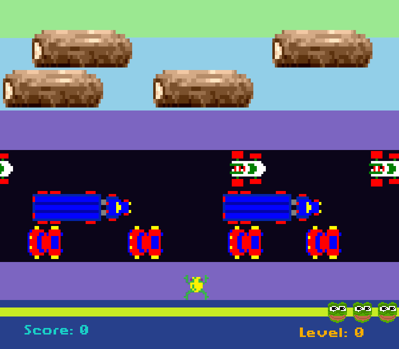
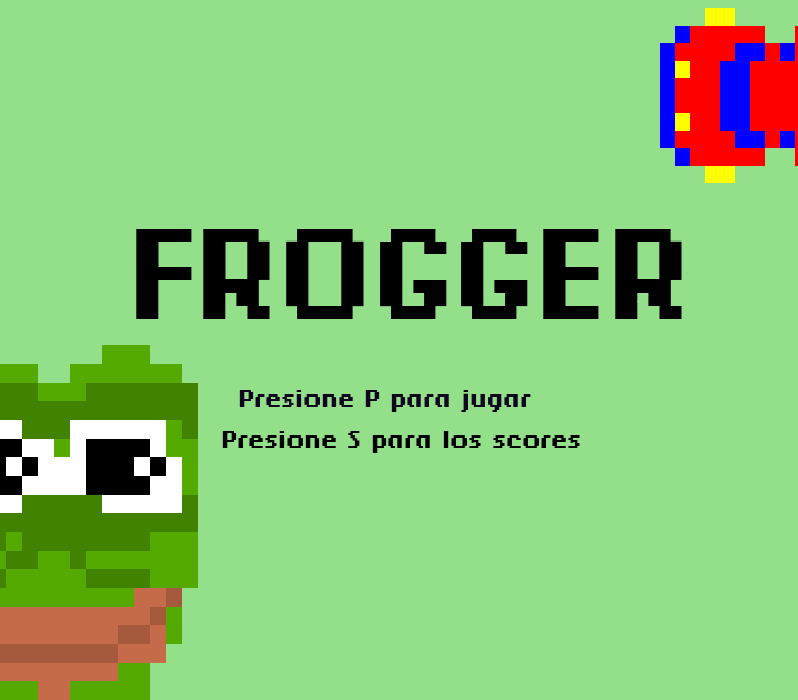
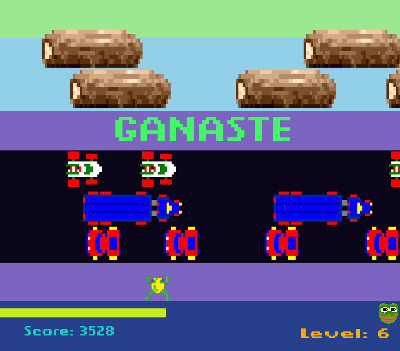
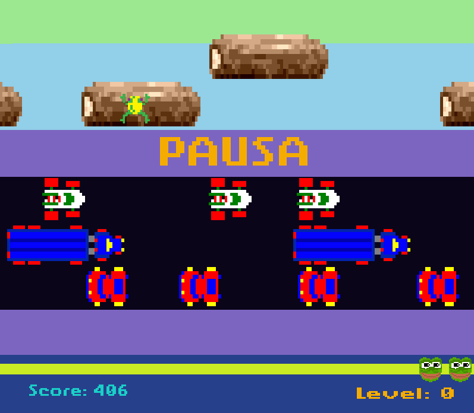
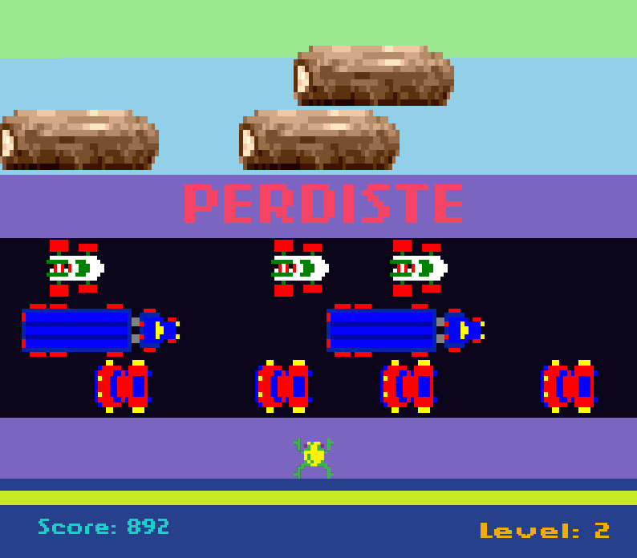

# Frogger


This is a frogger clone built in C with SDL2.

## Backstory
This project was created when I was learning to program back in 2018. I really enjoyed coding this frogger clone, although it's coded like crap (sorry lol), but this project made me fell in love with coding and because of that I have a big appreciation for this project.

## Getting Started
Use a linux distribution, or WSL (Windows Subsystem for Linux). 
```
sudo apt update && sudo apt upgrade -y

# Install SDL2
sudo apt install build-essential libsdl2-dev libsdl2-image-dev libsdl2-ttf-dev

# Compile the game 
gcc -o frogger frogger.c -lSDL2 -lSDL2_image -lSDL2_ttf

# Run the compiled game
./frogger
```

Enjoy! 

### Screenshots






